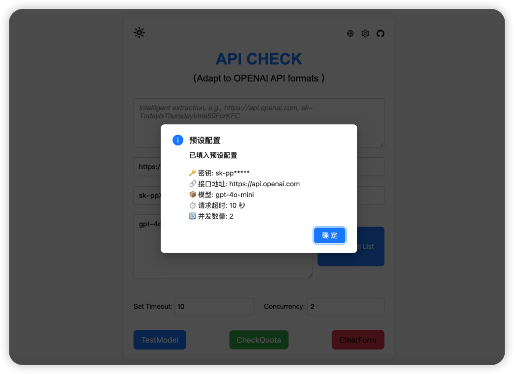
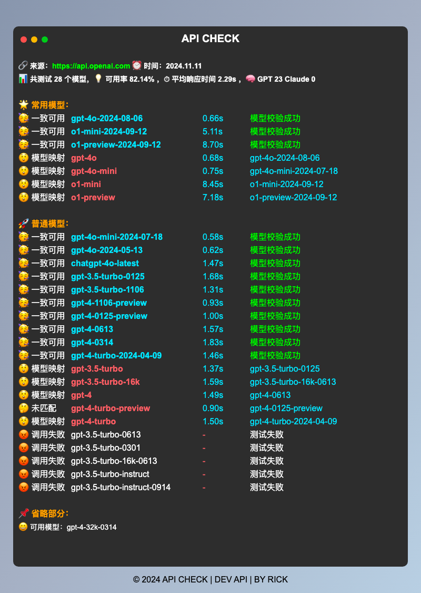

<div align="center">


# API CHECK

</div>

> [!TIP]
> 点击体验 : https://check.crond.dev

## 纯前端 API 检测工具

- ✅ **支持各种 OpenAI API 中转服务的测活**

  - 兼容 oneapi、newapi 等中转 OpenAI 格式的 API，全面检测可用性。

- 🔒 **纯前端版本，数据更安全**

  - 所有操作均在前端完成，无需担心网络超时，确保数据安全。

- 📊 **详细的测活数据**

  - 显示响应时间、模型一致性等信息，测试结果一目了然。

- 💾 **云端存储与本地存储**

  - **云端存储**：配置可保存至云端，实现多设备共享。
  - **本地存储**：常用配置本地保存，快速加载，方便快捷。

- 🌙 **主题和语言切换**

  - **深色/浅色模式**：根据喜好选择适合的主题，保护视力。
  - **多语言支持**：支持中文和英文，满足不同语言需求。

- 🖥️ **多种部署方式**
  - **Vercel 部署**：支持一键部署到 Vercel，方便快捷。
  - **Docker 部署**
  - **Cloudflare 部署**

## 📦开始使用

### vercel 部署

1. 点击右侧按钮开始部署：
   [](https://vercel.com/new/clone?repository-url=https://github.com/october-coder/api-check&env=PASSWORD&project-name=api-check&repository-name=api-check)，直接使用 Github 账号登录即可，记得在环境变量页填入 后端密码；
2. 部署完毕后，即可开始使用；
3. （可选）部署后端服务 请参考 [详细教程](./docs/vercel.md)。
4. （可选）[绑定自定义域名](https://vercel.com/docs/concepts/projects/domains/add-a-domain)：Vercel 分配的域名 DNS 在某些区域被污染了，绑定自定义域名即可直连。

### docker 部署

1. 一键部署命令

2. ```
   docker run -d -p 13000:13000 \
     -e PASSWORD=you_password \
     -v you_path:/app/data \
     --name api-check ghcr.io/rickcert/api-check:latest
   ```

### cloudflare 部署后端

1. 参考 [详细教程](./docs/cloudflare.md)。
2. 最好绑定自定义域名。

## 📜最近更新


### v2.1.0

🔔 **新特性与优化**

- ✨ **新增快捷聊天测试**
  - 对接魔改 NextChat，可快捷测试模型。
  - 新增 `closeChat` 设置，方便中转站使用。
- 🧪 **添加实验性功能模块** from [elfmaid](https://linux.do/u/elfmaid)
  - 批量测试 gpt Refresh Tokens
  - 批量测试 claude Session Keys
  - 批量测试 gemini API Keys
- ✂️ **新增粘贴按钮 ** by [fangyuan](https://linux.do/u/fangyuan99)
- 📝 **新增自定义对话验证功能**
  - 快捷prompt测试 by [fangyuan](https://linux.do/u/fangyuan99)

🔧 **优化与修复**

- 🐳 **优化 Dockerfile** 减小镜像体积。

- 🎨 **修复布局问题** 改善界面显示

### v2.0.0

🔔 **全新特性与优化**

- 🌐 **新增云端存储和本地存储功能**
  - **云端存储**：支持将 API 配置信息保存到云端服务器，实现多设备同步，随时随地访问您的配置。
  - **本地存储**：提供本地缓存功能，快捷保存到本地，避免重复输入，提高使用效率。
  - **数据管理**：新增设置面板，方便管理本地和云端的配置数据。
- ✨**支持预设参数**
  - **一键配置方便**
  - **快速绑定到 new-api**
- 💻 **支持 Vercel Docker 一键部署**
- 🌙 **新增暗黑模式**
  - **主题切换**：支持深色模式和浅色模式的切换，适应不同环境和用户偏好。
  - **自动适配**：可以根据系统设置自动切换主题，保护您的视力。
- 🌐 **国际化支持**
  - **多语言**：新增国际化支持，现已支持中文和英文。
- 📱 **移动端适配优化**
- 🛠 **其他优化和修复**

### 🧪 版本历史

<details>

### v1.5.0

- 📱 适配手机模式
- 🌙 新增暗黑主题
- 🧠 优化o1模型测试

### v1.4.0

- 🔍 新增温度验证功能
- 📊 新增函数验证功能
- 🔧 优化测试提示

### v1.3.0

- 🔍 新增官方API验证功能
- 🖥️ 支持筛选查询

### v1.2.0

- 🖥️ 添加本地一键运行功能
- 🌐 支持pages在线托管
- 📊 改进测试结果展示

### v1.0.0

- ✨ 支持多模型测试
- 💰 添加额度检查功能
- 📋 实现模型列表获取
</details>

## 📋 功能介绍

- 🧪 测试多个模型的可用性和一致性
- 💰 检查API账户使用额度
- 📋 获取并显示可用模型列表
- 📝 智能提取API信息
- 🖱️ 便捷的复制功能
- 💾 云端存储和本地缓存
- 🌙 主题和语言切换
- 🛠 高级验证功能

  - **官转验证**：验证 API 的真实性，查看系统指纹。
  - **温度验证**：验证模型的随机性和稳定性。
  - **函数调用验证**：测试模型的函数调用能力。

### 🛠 云端存储

- **Docker 部署** 后端url 请使用 https://your_website/api
- **Vercel 部署** 后端url 请使用 https://your_website/api
- **Cloudflare 部署** 后端url 请使用 https://your_website

### 🛠 预设参数设置



🔗 url

- **描述**: API 接口地址。
- **示例**: `"url": "https://api.example.com"`

📦 models

- **描述**: 模型名称数组，表示可以使用的模型。
- **示例**: `"models": ["model1", "model2"]`

⏱ timeout

- **描述**: 请求超时时间（以秒为单位）。
- **示例**: `"timeout": 30`

🔁 concurrency

- **描述**: 并发请求的数量。
- **示例**: `"concurrency": 5`

🚫 closeAnnouncement **方便中转站使用**

- **描述**: 是否关闭公告显示。设置为 `true` 时关闭公告显示，设置为 `false` 或未定义时显示公告。 **方便中转站使用**
- **示例**: `"closeAnnouncement": true`

🚪 closeChat **方便中转站使用**

- **描述**：是否关闭快捷聊天功能。设置为 `true` 时关闭聊天功能，设置为 `false` 或未定义时开启聊天功能。
- **示例**：`"closeChat": true`

```
https://check.crond.dev/?settings={"key":"*sk*","url":"*api*","models":["gpt-4o-mini","gpt-4o"],"timeout":10,"concurrency":2,"closeAnnouncement":true,"closeChat":true}
```

解码后的 JSON 字符串如下：

```json
{
  "key": "your_api_key",
  "url": "https://api.example.com",
  "models": ["gpt-4o-mini", "gpt-4o"],
  "timeout": 10,
  "concurrency": 2,
  "closeAnnouncement": true,
  "closeChat": true
}
```

- **voapi** 示例

```
{
  "name": "check",
  "link": "https://check.crond.dev/?settings={%22key%22:%22*sk*%22,%22url%22:%22*api*%22,%22models%22:[%22gpt-4o-mini%22],%22timeout%22:10,%22concurrency%22:2,%22closeAnnouncement%22:true,%22closeChat%22:true}",
  "icon": "https://check.crond.dev/logo.png"
}

```

- **newapi** 示例

```
{
  "CHECK": "https://check.crond.dev/?settings={\"key\":\"{key}\",\"url\":\"{address}\",\"models\":[\"gpt-4o-mini\"],\"timeout\":10,\"concurrency\":2,\"closeAnnouncement\":true,\"closeChat\":true}"
}

```

### 🛠 **高级验证功能**

#### 🕵️ 官方API验证

1. 🔄 发送多个相同的请求
2. 📊 分析响应的一致性
3. 🔍 检查系统指纹
4. 🧮 计算相似度得分

#### 🕵️‍♀️ 温度验证

1. 🧊 设置低温度参数（0.01）
2. 🔄 发送多个相同的请求（计算某个指定序列的下一个数）
3. 🎯 根据官方api参考值，检测命中率

### 🛠生成报告



## 🤝 贡献

欢迎提出建议和改进！随时提交 pull requests 或开启 issues。让我们一起让这个工具变得更棒！ 🌈

## 📜 许可证

本项目采用[Apache](https://opensource.org/license/apache-2-0)文件。

## 🙏 致谢

特别感谢以下贡献者，他们的努力使这个项目变得更好：

- [Rick](https://linux.do/u/rick)
- [Megasoft](https://linux.do/u/zhong_little)
- [fangyuan99](https://linux.do/u/fangyuan99)
- [juzeon](https://github.com/juzeon)
