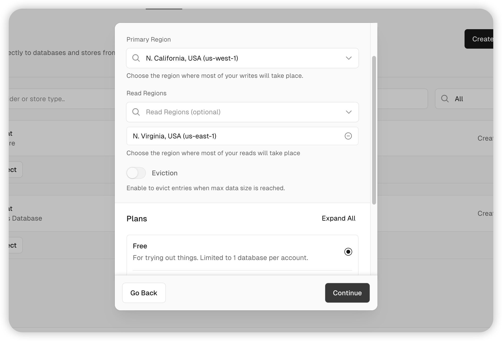
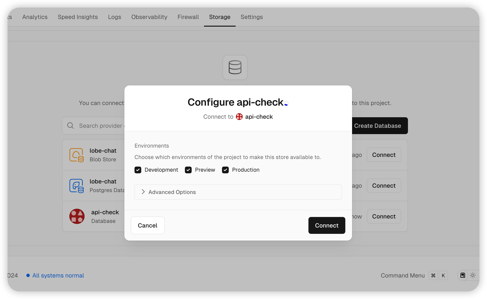
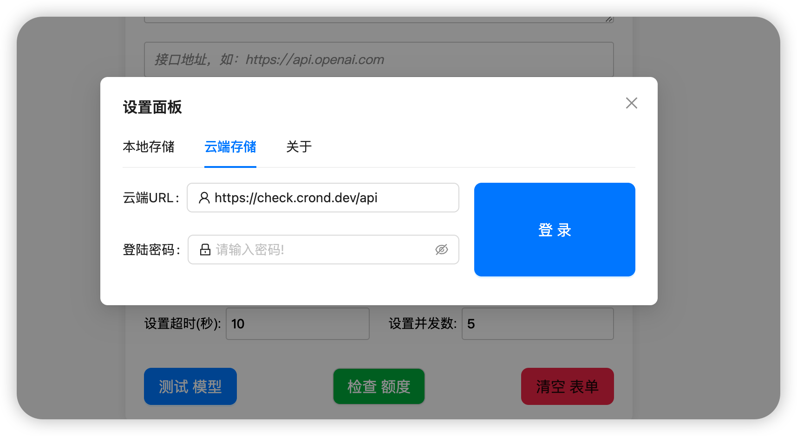

# 一、Vercel 一键部署整个项目教程

### 1. 配置 Vercel KV 存储

- 部署后，进入项目的 “Settings” 页面。

- 在左侧菜单中，找到 “Storage” 部分，点击 “KV”。

  

- 点击 “Create KV”，创建一个新的 KV 命名空间。

  - Name：自定义一个名称（如 `my-kv-store`）

- KV 创建后，将其绑定到您的项目中，**后需要重新部署项目**

   

### 2.在页面直接填入url + /api

